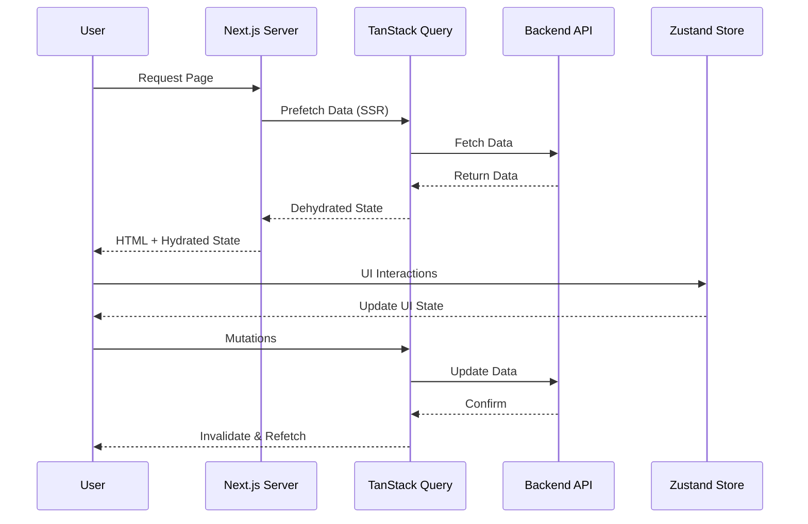

<div align="center">
  <h1>🎯 CEO VCCI Frontend</h1>
  <p><strong>A modern, high-performance enterprise frontend application built with Next.js 14</strong></p>
  
  <p>
    
    
    
    
  </p>
</div>

---

## 📖 Introduction

**CEO VCCI Frontend** is a clean, enterprise-ready web application template built on **Next.js 14 App Router** with TypeScript, TailwindCSS, and shadcn/ui components. This template provides a solid foundation with authentication, API integration, and modern development tools.

---

## ✨ Key Features

| Category | Features |
| --- | --- |
| 🚀 **Performance** | Server-Side Rendering (SSR), Image Optimization, Fast Refresh |
| 🎨 **UI/UX** | shadcn/ui components, TailwindCSS styling, Lucide icons |
| 📊 **Data Management** | TanStack Query v5, Zustand state management, React Hook Form + Zod validation |
| 🔐 **Security** | HttpOnly cookie authentication, Environment variable protection, ACL authorization |
| ⚡ **Developer Experience** | TypeScript strict mode, ESLint, Husky pre-commit hooks, Orval API code generation |

---

## 🚀 Getting Started

### Prerequisites

- Node.js 18+ 
- pnpm (recommended) or npm

### Installation

```bash
# Install dependencies
pnpm install

# Copy environment variables
cp .env.example .env

# Run development server
pnpm dev
```

Open [http://localhost:3000](http://localhost:3000) in your browser.

---

## 📁 Project Structure

```
src/
├── app/              # Next.js 14 App Router pages
│   ├── (auth)/       # Authentication pages (login, etc.)
│   ├── (main)/       # Main application pages
│   └── layout.tsx    # Root layout
├── components/       # React components
│   ├── ui/           # shadcn/ui components
│   ├── common/       # Common reusable components
│   └── features/     # Feature-specific components
├── api/              # API endpoints and models
│   ├── endpoints/    # API endpoint functions
│   └── models/       # TypeScript API models
├── auth/             # Authentication guards
├── configs/          # App configuration
├── hooks/            # Custom React hooks
├── lib/              # Utility libraries
├── stores/           # Zustand stores
├── types/            # TypeScript types
└── utils/            # Utility functions
```

---

## 🛠️ Tech Stack

- **Framework**: Next.js 14 (App Router)
- **Language**: TypeScript 5
- **Styling**: TailwindCSS + shadcn/ui
- **State Management**: Zustand + TanStack Query v5
- **Forms**: React Hook Form + Zod
- **API Client**: Orval (auto-generated from OpenAPI)
- **Icons**: Lucide React
- **Authentication**: Custom implementation with ACL

---

## 📝 Available Scripts

```bash
pnpm dev          # Start development server
pnpm build        # Build for production
pnpm start        # Start production server
pnpm lint         # Run ESLint
pnpm orval        # Generate API client from OpenAPI spec
```

---

## 🔧 Configuration

### Environment Variables

Create a `.env` file in the root directory:

```env
NEXT_PUBLIC_API_URL=your_api_url_here
```

### API Integration

This template uses Orval to generate type-safe API clients from OpenAPI specifications. Configure your API in `orval.config.ts`.

---

## 📚 Documentation

- [Coding Standards](./docs/CODING_STANDARDS.md)
- [Authorization & ACL](./docs/AUTHORIZATION.md)
- [Components Guide](./docs/COMPONENTS.md)
- [Project Overview](./docs/PROJECT.md)

---

## 📄 License

Private - All rights reserved

---

<div align="center">
  <p>Made with ❤️ using Next.js and TypeScript</p>
</div>
        CSR["Client Components"]
        API["API Routes"]
    end

    subgraph State["📊 State Management"]
        TQ["TanStack Query<br/>(Server State)"]
        ZS["Zustand<br/>(Client State)"]
    end

    subgraph UI["🎨 UI Layer"]
        ShadCN["shadcn/ui"]
        Tailwind["TailwindCSS"]
        Lucide["Lucide Icons"]
    end

    subgraph Backend["🔙 Backend Services"]
        RestAPI["REST API Server"]
        Auth["Auth Service"]
    end

    Browser --> SSR
    Browser --> CSR
    SSR --> TQ
    CSR --> TQ
    CSR --> ZS
    TQ --> RestAPI
    SSR --> RestAPI
    RestAPI --> Auth
    CSR --> UI
    SSR --> UI
```

### Data Flow Architecture



---

## 📦 Installation

### Prerequisites

Before you begin, ensure you have the following installed:

- **Node.js** >= 18.x
- **pnpm** >= 8.x (recommended) or npm >= 9.x
- **Git** >= 2.x

### Step-by-Step Installation

```bash
# 1. Clone the repository
git clone https://github.com/your-org/tts-frontend-client.git

# 2. Navigate to the project directory
cd tts-frontend-client

# 3. Install dependencies
pnpm install
# or with npm
npm install

# 4. Copy environment configuration
cp .env.example .env.local

# 5. Configure environment variables (see Environment Configuration section)

# 6. Generate API types (if needed)
pnpm gen:api
```

---

## 🚀 Running the Project

### Development

Start the development server with hot-reload:

```bash
pnpm dev
# or
npm run dev
```

Open [http://localhost:3000](http://localhost:3000) in your browser.

### Production Build

Create an optimized production build:

```bash
# Build the application
pnpm build

# Start the production server
pnpm start
```

### Available Scripts

| Script         | Description                                                  |
| -------------- | ------------------------------------------------------------ |
| `pnpm dev`     | Start development server on `localhost:3000`                 |
| `pnpm build`   | Create production build                                      |
| `pnpm start`   | Start production server                                      |
| `pnpm lint`    | Run ESLint for code quality                                  |
| `pnpm gen:api` | Generate TypeScript API client from OpenAPI spec using Orval |
| `pnpm prepare` | Setup Husky git hooks                                        |

---

## ⚙️ Environment Configuration

Create a `.env.local` file in the project root with the following variables:

```env
# ===========================================
# Application Configuration
# ===========================================
NEXT_PUBLIC_APP_URL=http://localhost:3000
NEXT_PUBLIC_APP_NAME="TTS Application"

# ===========================================
# API Configuration
# ===========================================
NEXT_PUBLIC_API_URL=https://api.example.com
NEXT_PUBLIC_API_VERSION=v1

# ===========================================
# Authentication
# ===========================================
# Note: Sensitive tokens should NOT use NEXT_PUBLIC_ prefix
AUTH_SECRET=your-auth-secret-key
JWT_SECRET=your-jwt-secret-key

# ===========================================
# Third-party Services (Optional)
# ===========================================
NEXT_PUBLIC_GOOGLE_ANALYTICS_ID=G-XXXXXXXXXX
NEXT_PUBLIC_SENTRY_DSN=https://xxx@sentry.io/xxx
```

> [!IMPORTANT]
>
> - Variables prefixed with `NEXT_PUBLIC_` are exposed to the browser
> - Keep sensitive data (API secrets, tokens) without the `NEXT_PUBLIC_` prefix
> - Never commit `.env.local` to version control

---

## 📁 Folder Structure

```
tts-frontend-client/
├── 📂 public/                    # Static assets (images, fonts, icons)
├── 📂 docs/                      # Project documentation
│   ├── CODING_STANDARDS.md       # Engineering guidelines
│   ├── COMPONENTS.md             # Component documentation
│   └── PROJECT.md                # Project standards
├── 📂 src/
│   ├── 📂 api/                   # Generated API clients (Orval)
│   │   ├── endpoints/            # API endpoint hooks
│   │   └── model/                # TypeScript types from OpenAPI
│   ├── 📂 app/                   # Next.js App Router
│   │   ├── (auth)/               # Authentication routes
│   │   ├── (main)/               # Main application routes
│   │   │   ├── dashboard/        # Dashboard module
│   │   │   ├── projects/         # Projects management
│   │   │   ├── schedule/         # Scheduling module
│   │   │   ├── attendance/       # Attendance tracking
│   │   │   ├── notifications/    # Notifications center
│   │   │   ├── reports/          # Reports & analytics
│   │   │   ├── documents/        # Document management
│   │   │   └── profile/          # User profile
│   │   ├── _providers/           # App-level providers
│   │   ├── globals.css           # Global styles
│   │   └── layout.tsx            # Root layout
│   ├── 📂 auth/                  # Authentication utilities
│   ├── 📂 components/
│   │   ├── ui/                   # shadcn/ui primitives
│   │   ├── common/               # Shared components (Header, Footer, etc.)
│   │   ├── features/             # Feature-specific components
│   │   ├── molecules/            # Composite components
│   │   └── organisms/            # Complex component compositions
│   ├── 📂 configs/               # Application configurations
│   ├── 📂 constants/             # Constants and enums
│   ├── 📂 hooks/                 # Custom React hooks
│   ├── 📂 lib/                   # Utility libraries
│   │   ├── utils.ts              # shadcn utility functions
│   │   ├── seo.ts                # SEO helper functions
│   │   └── api.ts                # API instance configuration
│   ├── 📂 providers/             # React context providers
│   ├── 📂 stores/                # Zustand state stores
│   ├── 📂 styles/                # Additional stylesheets
│   ├── 📂 types/                 # TypeScript type definitions
│   └── 📂 utils/                 # Utility functions
├── 📄 .eslintrc.json             # ESLint configuration
├── 📄 .gitignore                 # Git ignore rules
├── 📄 components.json            # shadcn/ui configuration
├── 📄 next.config.mjs            # Next.js configuration
├── 📄 orval.config.ts            # Orval API generator config
├── 📄 package.json               # Dependencies and scripts
├── 📄 postcss.config.mjs         # PostCSS configuration
├── 📄 tailwind.config.ts         # TailwindCSS configuration
└── 📄 tsconfig.json              # TypeScript configuration
```

---

## 🤝 Contribution Guidelines

We welcome contributions! Please follow these guidelines to maintain code quality and consistency.

### Development Workflow

1. **Fork** the repository
2. **Create** a feature branch: `git checkout -b feature/amazing-feature`
3. **Commit** your changes: `git commit -m 'feat: add amazing feature'`
4. **Push** to the branch: `git push origin feature/amazing-feature`
5. **Open** a Pull Request

### Commit Convention

We use [Conventional Commits](https://www.conventionalcommits.org/) for clear and structured commit history:

| Type       | Description                           |
| ---------- | ------------------------------------- |
| `feat`     | New feature                           |
| `fix`      | Bug fix                               |
| `docs`     | Documentation changes                 |
| `style`    | Code style changes (formatting, etc.) |
| `refactor` | Code refactoring                      |
| `test`     | Adding or updating tests              |
| `chore`    | Maintenance tasks                     |

**Example:**

```bash
git commit -m "feat(projects): add task filtering functionality"
git commit -m "fix(auth): resolve session timeout issue"
```

### Code Style Guidelines

- ✅ Use **TypeScript** strict mode
- ✅ Use **absolute imports** (`@/components/...`)
- ✅ Use **kebab-case** for file names (`user-profile.tsx`)
- ✅ Use **PascalCase** for component names (`UserProfile`)
- ✅ Use `cn()` utility for conditional class names
- ✅ Always provide `alt`, `width`, `height` for `<Image />` components
- ✅ Follow ESLint rules (run `pnpm lint` before committing)

### Pull Request Checklist

- [ ] Code follows the project's style guidelines
- [ ] Self-reviewed the code
- [ ] Added/updated tests if applicable
- [ ] Updated documentation if needed
- [ ] No lint errors or warnings
- [ ] Build passes successfully

---

## 📄 License

This project is **proprietary software**. All rights reserved.

Unauthorized copying, modification, distribution, or use of this software, via any medium, is strictly prohibited without explicit written permission from the project owner.

For licensing inquiries, please contact the project maintainers.

---

## 🗺️ Roadmap

### Current Version: v0.1.0

#### ✅ Completed

- [x] Next.js 14 App Router setup
- [x] shadcn/ui component library integration
- [x] TanStack Query for server state management
- [x] Zustand for client state management
- [x] i18n internationalization support
- [x] Orval API code generation
- [x] Authentication system
- [x] Dashboard module
- [x] Projects management
- [x] User profile management

#### 🚧 In Progress

- [ ] Advanced reporting & analytics
- [ ] Real-time notifications (WebSocket)
- [ ] Document management enhancements
- [ ] Mobile responsiveness improvements

#### 📋 Planned

- [ ] PWA support
- [ ] Offline mode capabilities
- [ ] Advanced caching strategies
- [ ] Performance monitoring dashboard
- [ ] E2E testing with Playwright
- [ ] CI/CD pipeline optimization
- [ ] Dark mode theme
- [ ] Accessibility (a11y) improvements

#### 🔮 Future Considerations

- [ ] Mobile app (React Native)
- [ ] Desktop app (Electron)
- [ ] AI-powered features integration
- [ ] Advanced data visualization

---

<div align="center">
  <p>Built with ❤️ by the TTS Team</p>
  <p>
    <a href="#-tts-frontend-client">Back to top ↑</a>
  </p>
</div>
